# Pima Indians Diabetes Analysis

## Overview
This project analyzes the **Pima Indians Diabetes Dataset** using R for the following tasks:
- **Principal Component Analysis (PCA)**
- **Factor Analysis**
- **Hierarchical Clustering**
- **Regression Modeling**

## Files
- **group_portfolio.R**: Code for PCA, Factor Analysis, and Clustering.
- **individual_portfolio.R**: Code for regression models and diagnostics.

## Key Visualizations

### 1. PCA Biplots
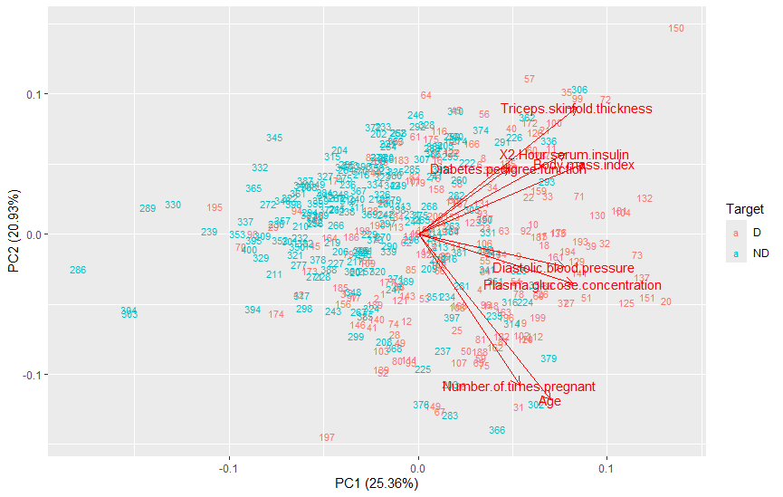


### 2. Scree Plot
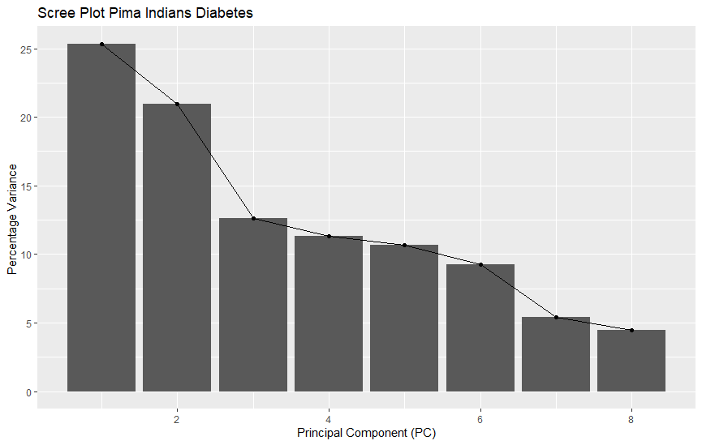

### 3. Loadings Plot
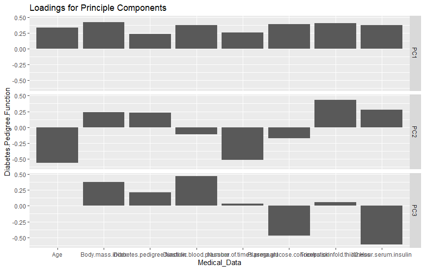

### 4. Factor Analysis Diagram
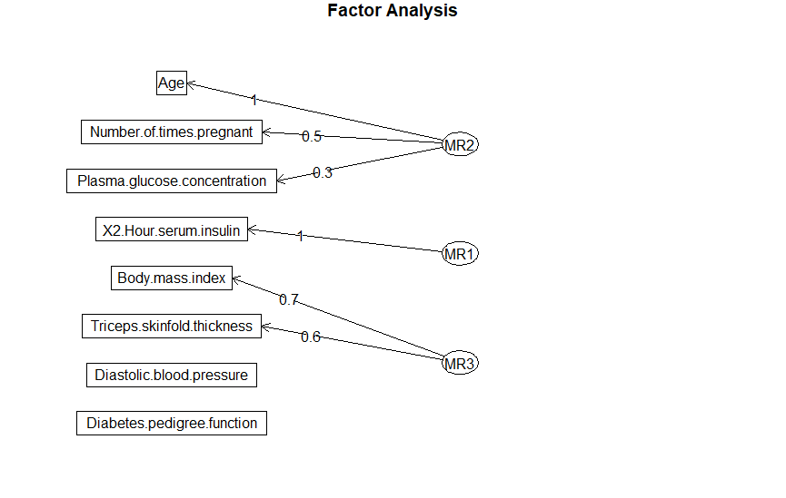

### 5. Hierarchical Clustering
- **Euclidean Distance (Complete Linkage)**:
  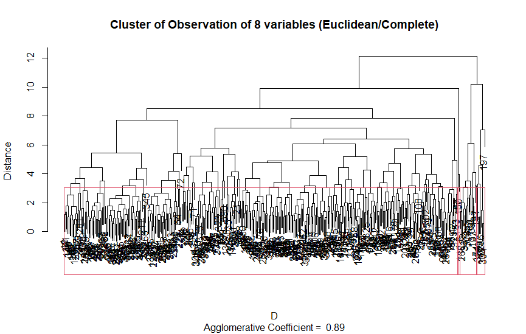
- **Manhattan Distance (Ward's Method)**:
  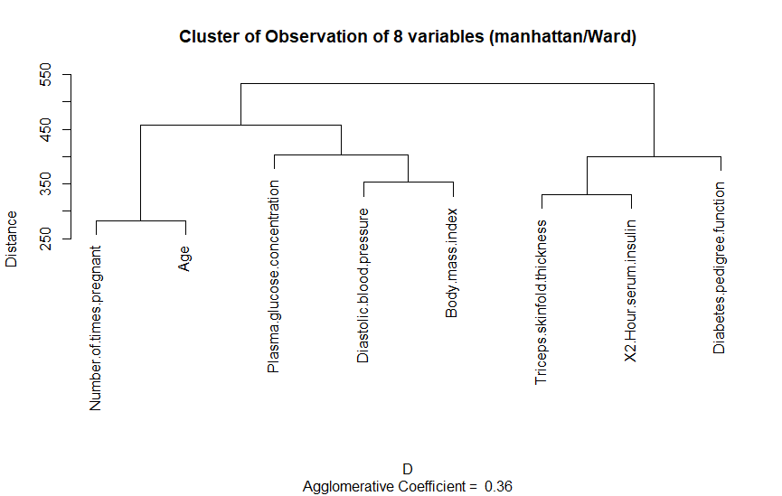

### 6. Scatter Plot Matrix
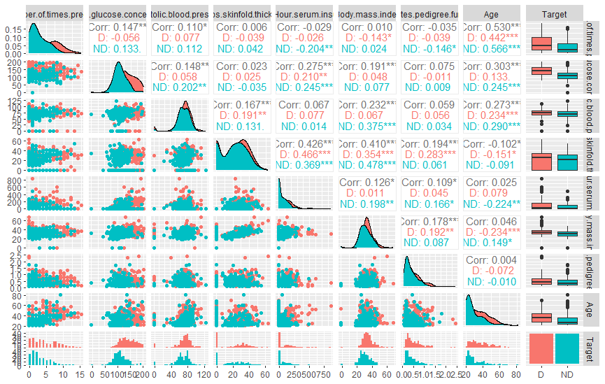

### 7. Scatter Plot: Triceps Skinfold Thickness vs Diabetes Pedigree Function
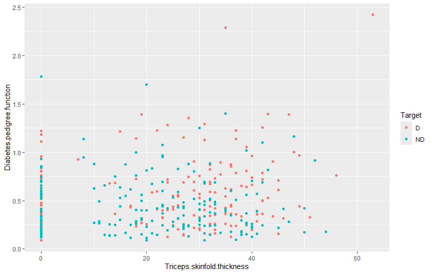

### 8. Regression Diagnostic Plots
- **Model 1 Diagnostic Plots**:
  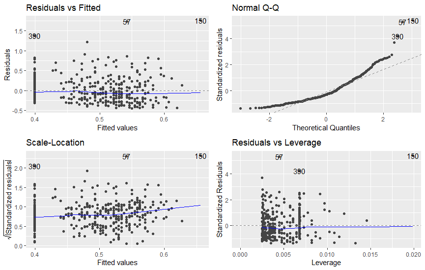
- **Model 2 Diagnostic Plots**:
  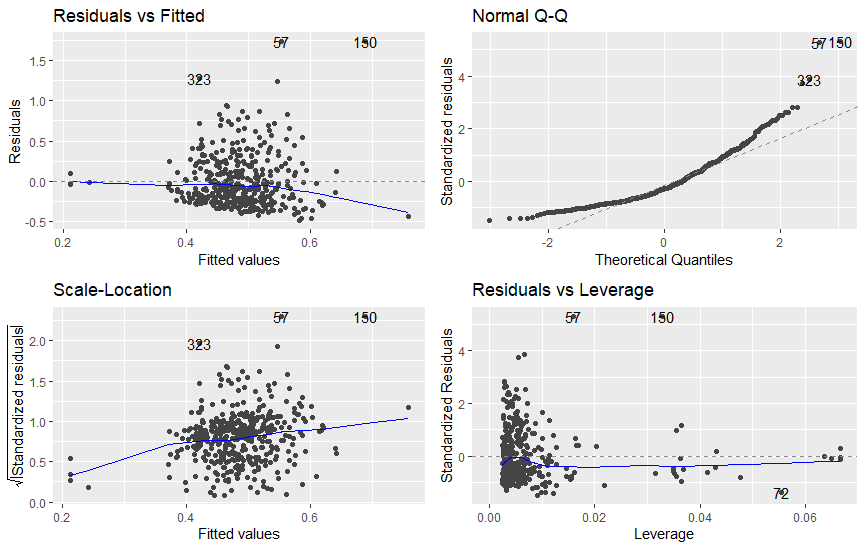
- **Model 3 Diagnostic Plots**:
  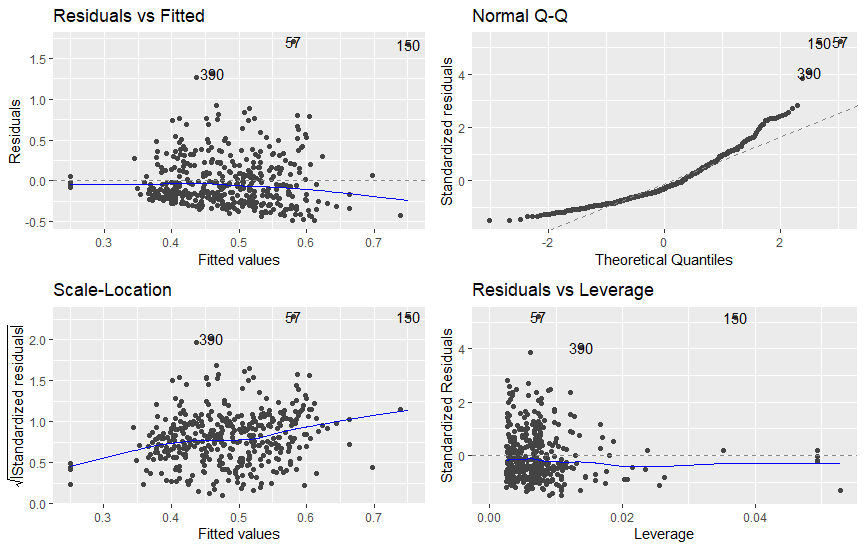
- **Model 4 Diagnostic Plots**:
  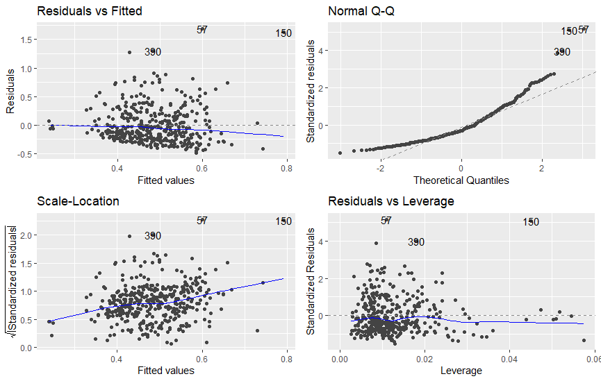

---

## Requirements
Install required R libraries:
```R
install.packages(c("tidyverse", "ggfortify", "psych", "cluster", "factoextra", "nFactors", "GGally", "olsrr"))

## Dataset
The dataset is available as `Pima_Indians_Diabetes_Dataset1.csv`.

## Instructions
1. Clone this repository:
   ```bash
   git clone <repository-url>
